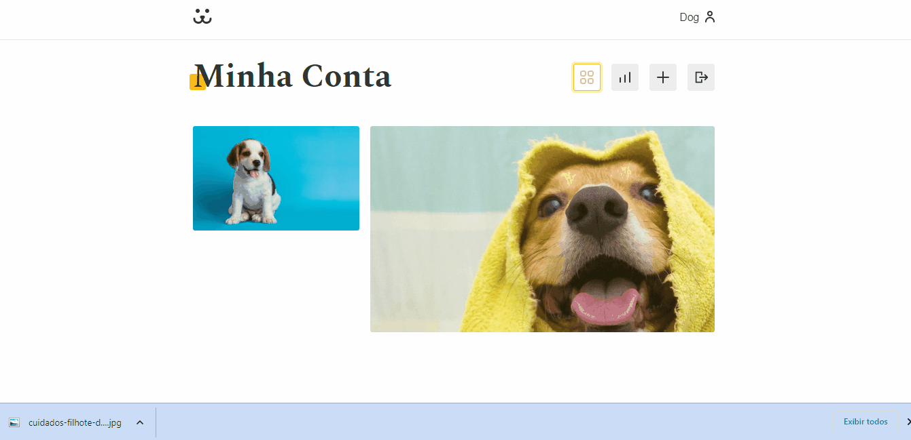

# Dogs - Rede social

Dogs é uma rede social feita em React que permite a postagem de conteúdo
sobre cães. Ela inclui funcionalidades como custom Hooks, requisição de API,
validação de formulários e rotas protegidas, tornando-a um projeto robusto.

---

## Feed:

O projeto possui um feed de fotos que permite ao usuário visualizar mais conteúdos acionando o scroll, mesmo sem estar logado.

---

## Login

Este projeto conta com formulários de autenticação e criação de novo usuário, que validam os campos de entrada para garantir que os dados inseridos pelo usuário são válidos. Além disso, caso perca a senha, é permitido que o usuário solicite a redefinição da senha fornecendo o endereço de e-mail associado à sua conta.

---

## Interações de usuário:

Logado, é possível visualizar, comentar, postar mais fotos e acompanhar as estatísticas de visualização.

